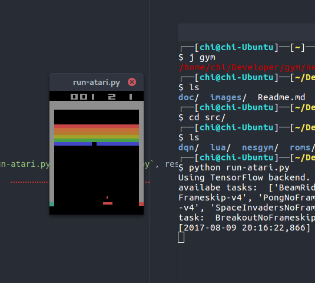
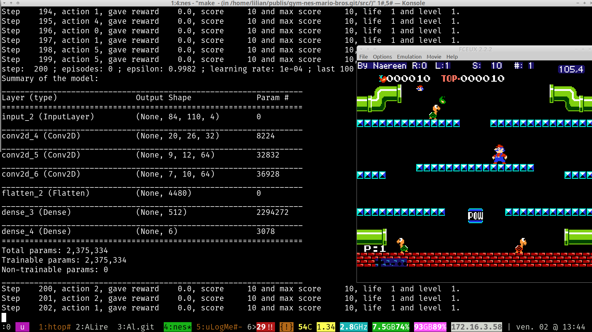
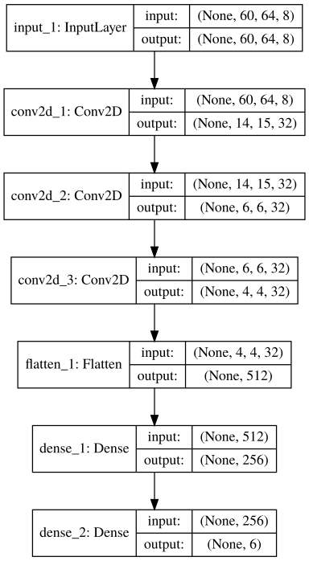
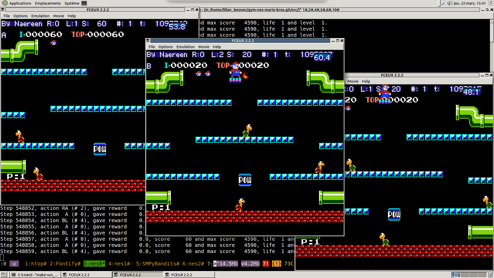
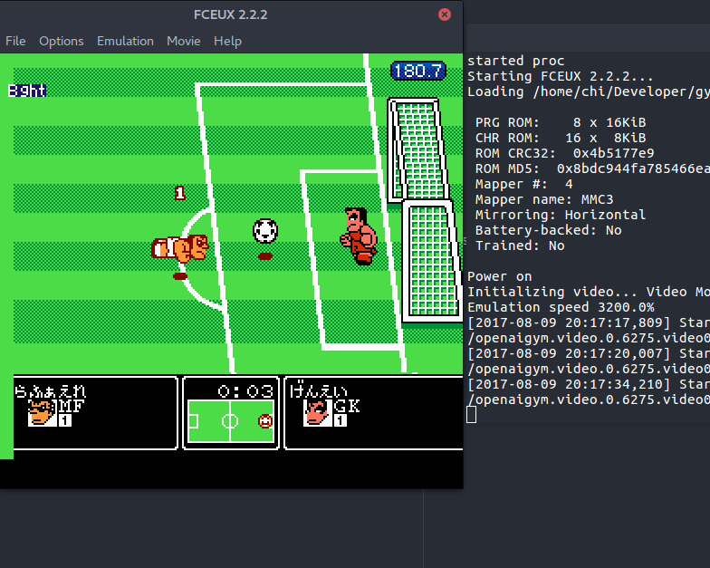

# OpenAI Gym for NES games + DQN with Keras to learn Mario Bros. from raw pixels

- An **EXPERIMENTAL** [openai-gym](https://gym.openai.com/) wrapper for NES games.
- With a Double Deep Q Network to learn how to play **Mario Bros.** game from 1983.

# Installation
> You can use a [`virtualenv`](http://virtualenv.pypa.io/) or a [`pipenv`](https://docs.pipenv.org/) if you want to install the dependencies in an isolated environment.

0. Use Python 3 only.
1. Install [openai-gym](https://github.com/openai/gym#installing-everything) and [keras](https://keras.io) with [tensorflow](https://www.tensorflow.org/) backend (with [`pip`](https://pip.pypa.io/)), and `cv2` (OpenCV module, on Debian/Ubuntu, `sudo pip install opencv-python`, see [this SO question](https://stackoverflow.com/a/41709383/)).
2. Install the [`fceux` NES emulator](http://www.fceux.com/) and make sure `fceux` is in your `$PATH`. In Debian/Ubuntu, you can simple use `sudo apt install fceux`. Version 2 at least is needed.
3. Find a `.nes` ROM for [Mario](https://en.wikipedia.org/wiki/Mario_Bros.) [Bros.](http://datacrystal.romhacking.net/wiki/Mario_Bros.) game (any dump for the Nintendo NES will do). Save it to [`src/roms/mario_bros.nes`](src/roms/).
4. Copy state files from `roms/fcs/*` to your `~/.fceux/fcs/` (faster loading for the beginning of the game).

# Example usage
For instance to load the Mario Bros. environment:

```python
# import nesgym to register environments to gym
import nesgym
env = gym.make('nesgym/MarioBros-v0')
obs = env.reset()

for step in range(10000):
    action = env.action_space.sample()
    obs, reward, done, info = env.step(action)
    ... # your awesome reinforcement learning algorithm is here
```

# Examples for training dqn
An implementation of dqn is in [`src/dqn`](src/dqn), using [keras](https://keras.io/).

You can train dqn model for Atari with [`run-atari.py`](src/run-atari.py) and for NES with [`run-soccer.py`](src/run-soccer.py) or [`run-mario.py`](src/run-mario.py).

# Integrating new NES games?
You need to write two files:

1. a [lua interface](http://www.fceux.com/web/help/LuaScripting.html) file,
2. and an [openai gym environment](https://gym.openai.com/envs/) class (python) file.

The lua file needs to get the reward from emulator (typically extracting from a memory location), and the python file defines the game specific environment.

For an example of lua file, see [`src/lua/soccer.lua`](src/lua/soccer.lua); for an example of gym env file, see [`src/nesgym/nekketsu_soccer_env.py`](src/nesgym/nekketsu_soccer_env.py).

> [This website](http://datacrystal.romhacking.net/wiki/Category:NES_games) gives RAM mapping for the most well-known NES games, this is very useful to extract easily the score or lives directly from the NES RAM memory, to use it as a reward for the reinforcement learning loop. See for instance [for Mario Bros.](http://datacrystal.romhacking.net/wiki/Mario_Bros.:RAM_map).

# Gallery
## Training Atari games


## Training NES games
### Mario Bros. game

> *That's new!*

Architecture of the DQN playning mario:



Overview of the experimentation with 3 emulators:



### Soccer game


---

### :scroll: License ? [](https://github.com/Naereen/gym-nes-mario-bros/blob/master/LICENSE)
This (small) repository is published under the terms of the [MIT license](http://lbesson.mit-license.org/) (file [LICENSE](LICENSE)).
© [Lilian Besson](https://GitHub.com/Naereen), 2018.

[](https://GitHub.com/Naereen/gym-nes-mario-bros/graphs/commit-activity)
[](https://GitHub.com/Naereen/gym-nes-mario-bros)
[](https://GitHub.com/Naereen/gym-nes-mario-bros/)

[](https://gym.openai.com/)
[](http://www.fceux.com/web/home.html)
[](https://www.python.org/)
[](https://www.Lua.org/)
[](https://Keras.io/)
[](https://www.tensorflow.org/)
[](https://opencv.org/)

[](https://GitHub.com/Naereen/)
[](http://ForTheBadge.com)
[](https://GitHub.com/)
